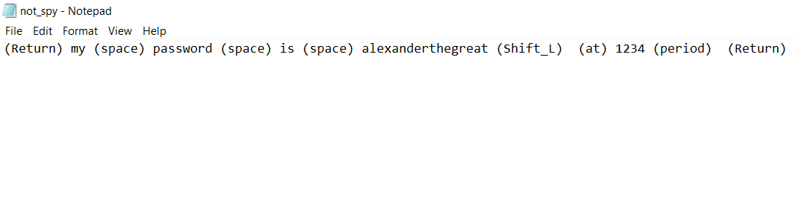

# ⌨️ Key_Logger 🎭

**🚨 Disclaimer:** *This application is created for learning purposes only. Implementing or using it without authorization may violate privacy laws and ethical standards.*

This keylogger application demonstrates how hackers can monitor keystrokes on a computer. It is a simple implementation using Python's Tkinter library for GUI and event handling.

## 🛠️ Main Technologies

- `Python 3.x`
  - `tkinter`

## 🚦 Running the Project

To run the project in your local environment,Python must be installed on your system and follow these steps:

1. Clone the repository to your local machine or just copy-paste the code in `key_logger.py`
2. Run `pip install tkinter` in the project directory to install the Tkinter library, which is usually included with Python installations.
3. Run `py key_logger.py` in terminal or click on run `▶️` button to get the project started.

## ⚙️ Functionality

The application captures keyboard events and displays the pressed keys on a graphical interface. Each key press is logged to a text file named `"not_spy.txt".`

- **🤹🏻 Event Handling:** When a key is pressed, the `do_something` function is triggered.

- **📜 Logging:** The function logs each key press to the text file. If the pressed key has a special function (e.g., space, enter, arrow keys), it is logged with its respective name; otherwise, the actual character is logged.

## ☠️ Potential Risks

This application highlights the potential dangers associated with keylogging:

1. **📝 Data Collection:** Every keystroke is recorded, potentially compromising sensitive information such as passwords, credit card details, and personal messages.
2. **🔐 Privacy Violation:** Keylogging without consent is a severe invasion of privacy and may lead to legal consequences.
3. **🛡️ Security Threat:** The logged data could be used for malicious purposes, including identity theft, financial fraud, or espionage.

## 🧭 Usage Guidelines

- **📚 Educational Purposes:** This application is intended for educational use to understand the mechanics of keylogging and raise awareness about cybersecurity threats.
- **👮 Legal Compliance:** Always ensure compliance with applicable laws and regulations before deploying or experimenting with such software.
- **⚖️ Ethical Considerations:** Respect privacy rights and obtain proper authorization before monitoring keyboard activity.
- **🔑 Secure Development:** If developing security-related software, prioritize security measures and ethical considerations to prevent misuse.
  
## 👩🏽‍🍳 Process 🍳

I created this application inorder to give 'Cybersecurity Awareness'. This application demonstrates keylogging techniques, it underscores the responsible development practices, and ethical considerations in software development and usage.

**❗ Remember:** Always prioritize privacy, security, and ethical conduct in technology-related endeavors.

## 🐛 Current Bug

So far, I'm not really sure if there are any bugs. However, there might be some issues. I tested it out on my computer (Windows 10), and so far it looks good there.

## 🍿 Preview

File : `not_spy.txt`

